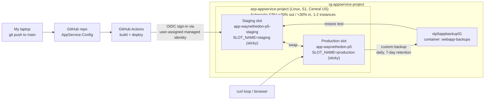

# App Service & Autoscaling (Project 5 of 6)

Hands-on Azure lab built for AZ-104 (Microsoft Azure Administrator) preparation. It targets **"Create and configure an Azure App Service,"** the #2 weak area from my first exam attempt, with a Linux App Service plan, a web app deployed from GitHub through a staging slot, a zero-downtime slot swap proven with a live request loop, CPU-based autoscale that really scaled out and back in, and a custom backup with a retention policy that was restored into a slot.

> Related repos: [VM-RBAC-Config](https://github.com/dwaynec-cloud/VM-RBAC-Config) (Project 1) · [VNet-Storage-Config](https://github.com/dwaynec-cloud/VNet-Storage-Config) (Project 2) · [Monitoring-Backup-Config](https://github.com/dwaynec-cloud/Monitoring-Backup-Config) (Project 3) · [Entra-Identity-Config](https://github.com/dwaynec-cloud/Entra-Identity-Config) (Project 4) · [Storage-Recovery-Config](https://github.com/dwaynec-cloud/Storage-Recovery-Config) (Project 6)
---

## Architecture



## What was built

| Requirement | Implementation |
|---|---|
| App Service plan with a defined SKU and region | `asp-appservice-project`: Linux, **Standard S1**, Central US. Standard is the minimum tier for deployment slots and autoscale |
| Web app deployed from a GitHub repo | `app-waynethedon-p5`, Python 3.14. A minimal Flask app (`app.py`) showing a version label, the slot's `SLOT_NAME` setting, and the serving instance ID, plus a `/burn` endpoint that keeps the CPU busy for 20 seconds. Deployed by GitHub Actions to the **staging slot only** |
| Deployment slots with a zero-downtime swap | Staging slot cloned from production. Two swaps: Version 1 into production, then Version 2 with a curl loop hitting production once per second. Every request returned HTTP 200 |
| Slot-specific settings | `SLOT_NAME` marked as a deployment slot setting on both slots, so it stays with its slot while the code moves |
| Autoscale rule on CPU | Rules-based autoscale on the plan: scale out by 1 when average CPU > 70% over 5 minutes, scale in by 1 when < 30% over 5 minutes, 5-minute cooldowns, instance limits 1 / 2 / 1. Triggered a real scale-out with the `/burn` endpoint, then scaled back in |
| Backup with a retention policy | Custom backup to `stp5appbackup01` (container `webapp-backups`), daily schedule, **7-day retention**, keep at least one backup. On-demand backup succeeded and was restored into the staging slot |

## Key decisions

**GitHub deploys to staging only. Production gets code only through a swap.** The Deployment Center was configured from the staging slot, so the generated workflow targets `slot-name: 'staging'`. Nothing reaches production without first running in staging, and after each swap the previous production version sits in staging as an instant rollback target.

**OIDC with a user-assigned managed identity instead of a publish profile.** Basic authentication was left disabled (Microsoft's current secure default). The Deployment Center created a user-assigned managed identity with a federated credential for the repo, so GitHub signs in with short-lived tokens and no password or publish profile is stored anywhere.

**S1, after working around zero quota.** The free-trial subscription had **0 quota for both S1 and Premium v3 P0v3 in North Central US**. Instead of trying tiers one by one in the Portal wizard, a CLI loop tried creating the plan in several regions and stopped at the first success: **Central US**, on S1, the tier the project spec named. The resource group's metadata stays in North Central US. Resource location and resource group location are independent.

**Rules-based autoscale, not Automatic scaling.** Automatic (platform-managed, HTTP-traffic-based) scaling is greyed out on Standard. It requires Premium v2 or v3. Rules-based autoscale works on Standard and above.

**Scale-out and scale-in thresholds far apart (70% / 30%).** Thresholds that are too close cause flapping: removing an instance pushes CPU straight back over the scale-out threshold. Max instances was kept at 2 to cap cost, especially with `/burn` publicly reachable.

**`SCM_DO_BUILD_DURING_DEPLOYMENT` made sticky on staging.** The Deployment Center added this setting (which tells App Service to install `requirements.txt` after each deployment) to staging only, as a non-sticky setting. Non-sticky settings move during a swap, so the first swap would have moved it to production and left staging without it, likely breaking the next deployment. Marking it as a slot setting kept it on staging, where every deployment lands.

**A custom backup rather than relying on automatic backups.** Automatic backups (hourly, kept 30 days) exist on Basic and above, but their frequency and retention can't be changed. A configurable retention policy requires a custom backup to a storage account. The storage account was left without a firewall, because backups to a firewalled account need extra networking setup.

## Challenges & troubleshooting

**Zero quota for S1 in North Central US.** Creating the web app failed with `Operation cannot be completed without additional quota. Current Limit (S1 VMs): 0`. App Service plans run on VMs behind the scenes, which is why the error counts VMs.


**P0v3 passed validation, then failed at deployment.** Switching to Premium v3 P0v3 cleared the Review + create page with no errors, but the actual deployment failed with the same error (`Current Limit (P0v3 VMs): 0`). **Portal pre-validation didn't check quota**, so a clean Review page wasn't proof the deployment would succeed.


**Restoring into a slot replaced the slot's settings.** Restoring the custom backup into staging (Portal, default options) brought back production's code, as intended, but also replaced staging's app settings with production's whole set: `SLOT_NAME` became `production`, and `SCM_DO_BUILD_DURING_DEPLOYMENT` was removed entirely because production never had it. Sticky settings protect a slot during swaps, not during restores. **After restoring into a slot, check its app settings before the next deployment.** I didn't notice a "restore site configuration" option on the restore page, so whether one was available is unconfirmed. Lesson: review every option on a restore page before running it.


**Zero downtime isn't an instant cutover.** During the Version 2 swap, responses alternated between Version 1 and Version 2 for about 20 seconds (16:36:30 to 16:36:49) before settling on Version 2. The most likely cause is App Service's multiple front-end servers picking up the routing change at slightly different moments. Every request still returned 200, but for a short window both versions served live traffic. That's why real releases need to be backward-compatible (for example, database changes both versions can handle).

**CPU spikes before the load test.** The CPU metric showed spikes near 100% before the `/burn` loops started. They lined up with the Version 2 swap (warm-up of the incoming instances, an app restart, and the curl loop running). They didn't trigger autoscale, because the rules didn't exist yet and the spikes didn't last a full 5-minute window.

**The slot setting didn't appear after it was saved.** After `SLOT_NAME` was added, the staging page still showed "not set". `az webapp config appsettings list` confirmed the setting existed. The browser was showing a cached page, and a hard refresh fixed it. Lesson: verify configuration with the CLI rather than trusting a browser view.

**The staging slot was found stopped before the restore test.** Production was running, so the subscription was fine. The cause is unknown (most likely a stray click on the slot's Stop button). Starting it with `az webapp start --slot staging` resolved it.

**Smaller fixes along the way.** `requirements.txt` was first saved as `requirments.txt`, which would have stopped App Service from installing Flask. `-o table` output dropped the plan's `reserved` (Linux) field and resource tags, so those were checked with JSON output or the Portal.

## Verification

> Screenshots in [`/screenshots`](./screenshots).

**Plan, slots and deployment**
1. App Service plan `asp-appservice-project`: Standard S1, Linux, Central US. 
2. Deployment slots: production and staging. 
3. Staging slot's Deployment Center: GitHub source, repo `AppService-Config`, branch `main`. 
4. GitHub Actions run with both the build and deploy jobs green. 
5. Staging app settings: `SLOT_NAME = staging` marked as a deployment slot setting. 

**Slot swaps**

6. After the first swap: production serving Version 1 with `Slot setting: production`. Staging now held the old placeholder, because a swap exchanges content rather than copying it. 
7. Version 2 pushed to GitHub and deployed to staging only. Production still served Version 1. 
8. Curl loop against production during the second swap: Version 1, a short alternating window, then Version 2, **all HTTP 200**. 
9. Production after the swap: Version 2 with `Slot setting: production`. The code moved, and the sticky setting stayed. 

**Autoscale**

10. Autoscale rules on the plan: CPU > 70% scale out, CPU < 30% scale in, limits 1 / 2 / 1. 
11. Run history: scale-out from 1 to 2 instances, triggered by two parallel `/burn` loops holding CPU near 100%. The plan later scaled back in to 1 instance after the load stopped. 
12. Ten cookie-less curl requests split 5/5 across two instance IDs (`1b5962cc` and `7922f290`), proving both instances served traffic. 

**Backup and restore**

13. Custom backup configuration: `stp5appbackup01` / `webapp-backups`, daily, 7-day retention, keep at least one backup. 
14. On-demand custom backup: Succeeded. 
15. Restore into the staging slot: staging went from Version 1 to Version 2 (the version production served when the backup was taken). 

## App Service notes

- **Plan vs. app.** The App Service plan is the compute (tier, VM size, instance count, region) and is what you pay for. The web app runs on it. Several apps can share one plan and its instances, and scaling is configured on the plan, not the app. **Stopping an app doesn't stop billing**: the plan's instances are billed either way.
- **Scale up vs. scale out.** Scaling up changes the tier (bigger instances, may briefly restart the app). Scaling out adds instances of the same size. Autoscale only scales out and in.
- **Tier limits worth remembering.** Deployment slots and autoscale need Standard or higher. Max instances: Basic 3, Standard 10, Premium 30, Isolated 100. Slots: Standard 5, Premium 20. Zone redundancy needs Premium v2 or higher (or Isolated v2).
- **What a swap moves.** Code and non-sticky settings move. Sticky (deployment slot) settings stay with the slot. Before switching traffic, Azure warms up the incoming instances, which is where zero downtime comes from.
- **Cloning a slot** copies configuration (app settings, runtime version, general settings), not content, Deployment Center settings or scale settings.
- **ARR affinity** is on by default and pins a browser to one instance with a cookie. That's why the instance-split test used curl, which sends no cookies.
- **Swap with preview** (multi-phase swap) applies the target's settings to the source slot and pauses for testing before completing. Not used here.

## How to reproduce

1. **App code:** a Flask `app.py` with an `app` object and a `requirements.txt` (`Flask>=3.0`, `gunicorn`) at the repo root. App Service's build system detects `app.py` and starts it with Gunicorn, so no startup command is needed.
2. **Resource group:**
   ```bash
   az group create --name rg-appservice-project --location northcentralus --tags projects=appservice
   ```
3. **Plan** (try regions until quota allows it):
   ```bash
   for r in centralus eastus2 westus2 southcentralus westus3; do echo "== Trying $r"; az appservice plan create -g rg-appservice-project -n asp-appservice-project -l $r --sku S1 --is-linux --tags projects=appservice -o none && echo "SUCCESS in $r" && break; done
   ```
4. **Web app:** Portal > App Services > Create > Web App. Python runtime, same region as the plan, select the existing plan. Continuous deployment and basic authentication off, Application Insights off.
5. **Staging slot:** web app > Deployment > Deployment slots > Add slot `staging`, cloning settings from production.
6. **GitHub Actions:** from the **staging slot**, Deployment > Deployment Center > Source GitHub > repo and branch > Authentication **User-assigned identity** (create new) > Save. Check that the generated workflow contains `slot-name: 'staging'`.
7. **Slot settings:** on each slot, Settings > Environment variables > add `SLOT_NAME` (`production` / `staging`) with **Deployment slot setting** checked. Make the Deployment Center's build setting sticky on staging:
   ```bash
   az webapp config appsettings set -n app-waynethedon-p5 -g rg-appservice-project --slot staging --slot-settings SCM_DO_BUILD_DURING_DEPLOYMENT=1
   ```
8. **Swap with a downtime check:** start the loop, then swap staging into production in the Portal.
   ```bash
   PROD=$(az webapp show -n app-waynethedon-p5 -g rg-appservice-project --query defaultHostName -o tsv)
   while true; do r=$(curl -s -m 5 -w '\n%{http_code}' https://$PROD); echo "$(date +%T) $(echo "$r" | grep -o 'Version [0-9]') HTTP $(echo "$r" | tail -n1)"; sleep 1; done
   ```
9. **Autoscale:** plan > Scale out (App Service plan) > Rules Based > Configure > Custom autoscale > scale based on a metric, limits 1 / 2 / 1, plus the two CPU rules. Generate load with two parallel loops of `curl -s -m 60 https://$PROD/burn` and watch Run history (expect 10 to 15 minutes).
10. **Backup:** create a storage account in the same region, then web app > Settings > Backups > Configure custom backups > storage account and container, daily schedule, retention days, keep at least one backup > Save > Backup now.

## Cleanup

The plan bills per instance-hour whether the apps on it run or not. After capturing screenshots, the whole resource group was deleted (plan, both slots, autoscale setting, storage account and backups, and the managed identity):

```bash
az group delete -n rg-appservice-project --yes --no-wait
az group exists -n rg-appservice-project
```

The GitHub Actions workflow was then **disabled** (not deleted), so pushes to this repo no longer try to deploy to resources that don't exist. The workflow file stays in `.github/workflows/` as evidence of the pipeline. Project 5's App Service plan cost **$1.33** in total.

## Next steps

- Codify the plan, web app, staging slot, slot settings and autoscale setting in **Bicep**.
- Remove the public `/burn` endpoint, or protect it with authentication or **access restrictions**. As built, anyone who found the URL could drive CPU up and trigger autoscale.
- Move the deployment pipeline's swap into GitHub Actions (deploy to staging, run a smoke test, then swap automatically) instead of swapping in the Portal.
- Try **swap with preview** and **testing in production** (routing a percentage of traffic to the staging slot).
- Add the networking side: **VNet integration**, a **private endpoint** for the app, and a backup storage account behind a firewall with the required networking.
- Configure **Health check** so unhealthy instances are removed from the load balancer.
